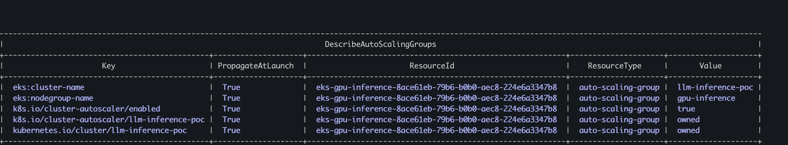
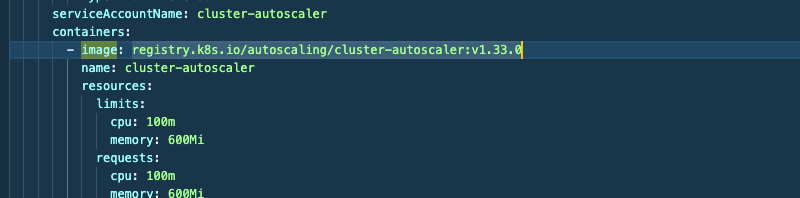
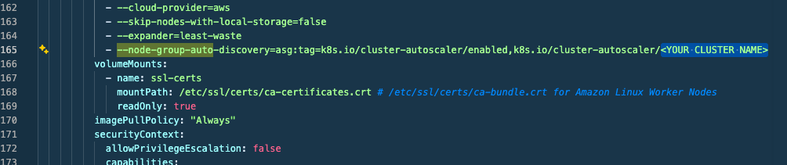
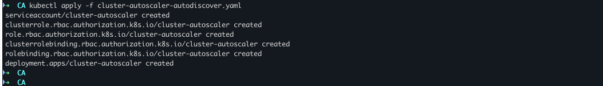
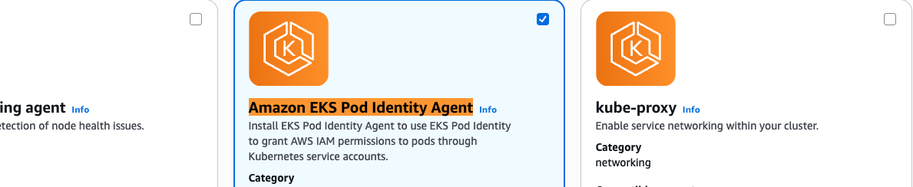
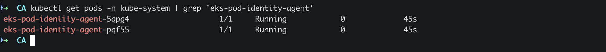

# Inference with AWS EKS


```
# Quick way to see who currently has cluster admin
kubectl describe configmap aws-auth -n kube-system
aws eks list-access-entries --cluster-name llm-inference-poc \
--region eu-west-1
```


## Install CSI driver for Amazon EBS

```
eksctl create iamserviceaccount \
--name ebs-csi-controller-sa \
--namespace kube-system \
--cluster my-cluster \
--role-name AmazonEKS_EBS_CSI_DriverRole \
--role-only \
--attach-policy-arn arn:aws:iam::aws:policy/service-role/AmazonEBSCSIDriverPolicy \
--approve
```

the above command:
- Creates an IAM Role
- Configures it for IRSA (OIDC trust relationship)
- Associates it with the service account ebs-csi-controller-sa

That is the classic and most common method used for EKS add-ons.

Make sure your cluster has OIDC enabled, otherwise IRSA won't work. If empty, enable the oidc.
```
aws eks describe-cluster \
--name llm-inference-poc \
--query "cluster.identity.oidc.issuer" \
--output text
```

After this open console and go to add on 


After installation you should see


## Install AWS Load Balancer Controller with Helm

```
# Admin access entry for your IAM role:
aws eks create-access-entry \
  --cluster-name llm-inference-poc \
  --principal-arn arn:aws:iam::xx:user/terraform \
  --region eu-west-1

# Then attach admin permissions:
aws eks associate-access-policy \
  --cluster-name llm-inference-poc \
  --principal-arn arn:aws:iam::<aws_account>:user/terraform-dmytro \
  --policy-arn arn:aws:eks::aws:cluster-access-policy/AmazonEKSClusterAdminPolicy \
  --access-scope type=cluster \
  --region eu-west-1
# Use profile
eksctl create iamserviceaccount \
--cluster llm-inference-poc \
--namespace kube-system \
--name aws-load-balancer-controller \
--attach-policy-arn arn:aws:iam::<aws_account>:policy/AWSLoadBalancerControllerIAMPolicy \
--override-existing-serviceaccounts \
--region eu-west-1 \
--profile <user profile> \
--approve

# install
helm install aws-load-balancer-controller eks/aws-load-balancer-controller \
  -n kube-system \
  --set clusterName=my-cluster \
  --set serviceAccount.create=false \
  --set serviceAccount.name=aws-load-balancer-controller \
  --set region=eu-west-1 \
  --set vpcId=<vpc-id> \
  --version 1.14.0
```

once done check pod status 


# install cluster autoscaler


```bash
# To check if the node groups ASG have the mentioned tag
aws autoscaling describe-auto-scaling-groups \ 
--query "AutoScalingGroups[*].AutoScalingGroupName" --output table

# validate tags
aws autoscaling describe-auto-scaling-groups \
--auto-scaling-group-names eks-gpu-inference-8ace61eb-79b6-b0b0-aec8-224e6a3347b8 \
--query "AutoScalingGroups[*].Tags" --output table
```


- Let's start with creating an IAM policy for the Cluster AutoScaler
```json
cat <<EoF > autoscaler-policy.json
{
  "Version": "2012-10-17",
  "Statement": [
    {
      "Effect": "Allow",
      "Action": [
        "autoscaling:DescribeAutoScalingGroups",
        "autoscaling:DescribeAutoScalingInstances",
        "autoscaling:DescribeLaunchConfigurations",
        "autoscaling:DescribeScalingActivities",
        "ec2:DescribeImages",
        "ec2:DescribeInstanceTypes",
        "ec2:DescribeLaunchTemplateVersions",
        "ec2:GetInstanceTypesFromInstanceRequirements",
        "eks:DescribeNodegroup"
      ],
      "Resource": ["*"]
    },
    {
      "Effect": "Allow",
      "Action": [
        "autoscaling:SetDesiredCapacity",
        "autoscaling:TerminateInstanceInAutoScalingGroup"
      ],
      "Resource": ["*"]
    }
  ]
}
EoF
```
- once above json is ready, create policy

```
aws iam create-policy   \
  --policy-name autoscaler-policy \
  --policy-document file://autoscaler-policy.json

export POLICY_ARN=$(aws iam list-policies --query "Policies[?PolicyName=='autoscaler-policy'].Arn" --output text)
echo $POLICY_ARN
```

- IAM Role json
```json
cat <<EoF > trust-policy.json
{
    "Version": "2012-10-17",
    "Statement": [
      {
        "Effect": "Allow",
        "Principal": {
          "Service": "pods.eks.amazonaws.com"
        },
        "Action": [
          "sts:AssumeRole",
          "sts:TagSession"
        ]
      }
    ]
}
EoF
```
- create role

```bash
# role create
aws iam create-role --role-name  autoscaler-role \
    --assume-role-policy-document file://trust-policy.json

# policy attachment
aws iam attach-role-policy --role-name autoscaler-role \
    --policy-arn $POLICY_ARN

export ROLE_ARN=$(aws iam get-role --role-name autoscaler-role \
--query "Role.Arn" --output text)

# download the CA file
wget https://raw.githubusercontent.com/kubernetes/autoscaler/master/cluster-autoscaler/cloudprovider/aws/examples/cluster-autoscaler-autodiscover.yaml

# get your cluster version
aws eks describe-cluster --name llm-inference-poc --query cluster.version --output json
```

- Use the table to find out CA version for you, as per your cluster version [Cluster Autoscaler version](https://github.com/kubernetes/autoscaler/tree/master/cluster-autoscaler#releases)



- Update your cluster name



- deploy



- enable pod identity 



- validate 


```bash
eksctl create podidentityassociation \
    --cluster llm-inference-poc \
    --namespace kube-system \
    --service-account-name cluster-autoscaler \
    --role-arn $ROLE_ARN
# restart
kubectl rollout restart deploy cluster-autoscaler -n kube-system

```

