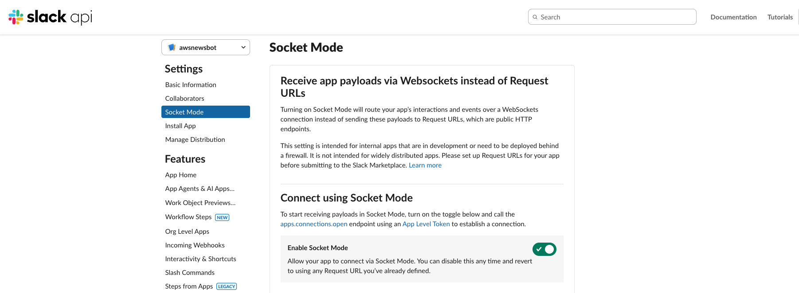

# Quick Start Guide

Get your AWS News Slack Bot running in 5 minutes! You can test this bot on your local machine using `slack's socket mode`.


```
⚠️ Please note I am running my AWS news mcp server locally 😀. 
The MCP server is a simple HTTP server that provides the required endpoint
for the bot to call. You can run it from:
-  https://github.com/arunksingh16/aws-news-mcp
```


## Prerequisites Checklist

- [ ] Slack workspace (with admin access)
- [ ] Azure OpenAI account with deployed model
- [ ] MCP Server deployed on AWS (or running locally)
- [ ] Python 3.10 or higher

## Step 1: Create Slack App (5 minutes)

1. Go to https://api.slack.com/apps → **Create New App** → **From scratch**
2. Name it "AWS News Bot" and select your workspace

### Configure Permissions

Go to **OAuth & Permissions** → **Bot Token Scopes** and add:
```
app_mentions:read
users:read
chat:write
commands
im:history
im:read
im:write
channels:history
groups:history
```

### Enable org-readiness

1. Go to **org-level** → **Enable org-readiness**

### Add Redirect URLs
You will need to configure redirect URLs in order to automatically generate the Add to Slack button or to distribute your app.

### Enable Socket Mode

1. **Socket Mode** → Enable
2. Generate **App-Level Token** with `connections:write, authorizations:read, app_configurations:write` scope
3. Save token (starts with `xapp-`)

   

### Add Slash Command

**Slash Commands** → Create:
- Command: `/awsnews`
- Description: "Ask AWS News Bot a question"

### Subscribe to Events

**Event Subscriptions** → Enable → **Bot Events**:
```
app_mention
message.channels
```

### Install App

**Install App** → **Install to Workspace** → Authorize

Copy the **Bot User OAuth Token** (starts with `xoxb-`)

## Step 2: Install Bot (2 minutes)

```bash
cd slack-bot-for-aws-news
./setup.sh
```

This will:
- Create virtual environment
- Install dependencies
- Create `.env` file

## Step 3: Configure (2 minutes)

Edit `.env` file with your credentials:

```env
# From Slack App Settings
SLACK_BOT_TOKEN=xoxb-...
SLACK_APP_TOKEN=xapp-...

# From Azure OpenAI
AZURE_OPENAI_API_KEY=your-key
AZURE_OPENAI_ENDPOINT=https://your-resource.openai.azure.com/
AZURE_OPENAI_DEPLOYMENT_NAME=gpt-4

# Your MCP Server
MCP_SERVER_URL=https://your-mcp-server.amazonaws.com
```

## Step 4: Run! (1 minute)

```bash
./run.sh
```

Or manually:
```bash
source venv/bin/activate
python bot.py
```

## Step 5: Test (1 minute)

In Slack:

1. **Invite bot to a channel:**
   ```
   /invite @awsnews
   ```

2. **Ask a question:**
   ```
   @awsnews what's new with EC2 this week?
   ```

3. **Or use slash command:**
   ```
   /awsnews show me latest Lambda news
   ```

## Troubleshooting

### Bot not responding?
- Check bot is invited to channel: `/invite @awsnews`
- Check logs for errors
- Verify tokens in `.env`

### MCP Server errors?
- Test server: `curl https://your-mcp-server.amazonaws.com/health`
- Check URL in `.env`

### Azure OpenAI errors?
- Verify API key and endpoint
- Check deployment name
- Ensure model is deployed

## Common Commands

```bash
# Start bot
./run.sh

# Stop bot
Ctrl+C

# View logs (when running)
tail -f logs/bot.log

# Run with Docker
docker-compose up -d

# Stop Docker
docker-compose down

# View Docker logs
docker-compose logs -f
```

## Example Queries

Try asking:
- "What's new with Lambda this week?"
- "Show me recent S3 announcements"
- "What are the latest AWS updates?"
- "Any news about Amazon Bedrock?"
- "Tell me about EC2 features launched this month"

## Next Steps

- Customize the weekly digest schedule in `bot.py`
- Add more channels for notifications
- Deploy to production (AWS ECS, EC2, etc.)
- Monitor logs and performance

## Need Help?

See the full [README.md](README.md) for detailed documentation.

